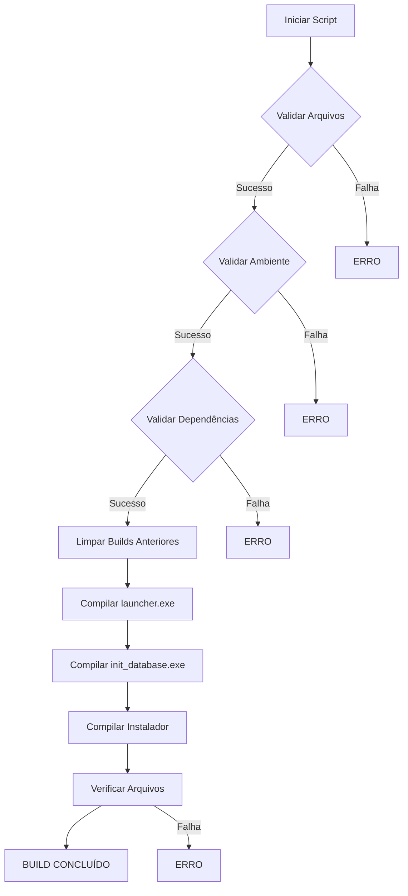

# 📦 Scripts de Build Automatizado

Este projeto inclui dois scripts de build automatizado para compilar o Sistema de Controle de Caixa:

## 🚀 Scripts Disponíveis

### 1. build.bat (Windows Batch)
- **Compatibilidade**: Windows (cmd.exe)
- **Requisitos**: Windows 7+ com PowerShell
- **Uso**: Duplo clique ou `build.bat`

### 2. build.ps1 (PowerShell)
- **Compatibilidade**: Windows PowerShell 5.1+
- **Requisitos**: PowerShell com permissão de execução
- **Uso**: `.\build.ps1` ou `powershell -ExecutionPolicy Bypass -File build.ps1`

## 📋 Pré-requisitos

### Obrigatórios:
1. **Python 3.8+** com ambiente virtual configurado
2. **PyInstaller**: `pip install pyinstaller`
3. **Inno Setup**: Disponível no PATH
4. **Arquivos do projeto**: launcher.py, init_db.py, setup.iss

### Verificação:
```bash
# Verificar ambiente virtual
python -m venv .venv
.venv\Scripts\activate

# Instalar dependências
pip install pyinstaller

# Verificar Inno Setup
where iscc
```

## 🎯 Funcionalidades

### 🔍 Validações Automáticas:
- ✅ Verificação de arquivos essenciais
- ✅ Verificação de ambiente virtual
- ✅ Verificação de dependências
- ✅ Verificação de saída dos builds

### 🛠️ Processos de Build:
1. **Limpeza** de builds anteriores
2. **Compilação** do launcher.exe
3. **Compilação** do init_database.exe
4. **Compilação** do instalador completo
5. **Verificação** de todos os arquivos gerados

### 📊 Informações de Build:
- Tamanho dos arquivos gerados
- Status de cada etapa
- Opção de executar instalador automaticamente

## 🎮 Uso dos Scripts

### build.bat:
```cmd
# Execução normal
build.bat

# Execução sem pausa final
build.bat --no-pause
```

### build.ps1:
```powershell
# Execução normal
.\build.ps1

# Com opções avançadas
.\build.ps1 -Clean -SkipTests -NoPause

# Limpar builds anteriores
.\build.ps1 -Clean

# Pular testes (se implementados)
.\build.ps1 -SkipTests

# Sem pausa final
.\build.ps1 -NoPause
```

## 📁 Arquivos Gerados

Após execução bem-sucedida:

```
dist/
├── controle_de_caixa.exe        # Launcher principal
├── init_database.exe         # Inicializador do banco
└── Controle_de_Caixa-Setup.exe # Instalador completo
```

## 🔧 Parâmetros do PowerShell

| Parâmetro | Descrição | Padrão |
|------------|-------------|----------|
| `-Clean` | Limpa builds anteriores | `$false` |
| `-SkipTests` | Pula testes automatizados | `$false` |
| `-NoPause` | Não pausa no final | `$false` |

## 🚨 Solução de Problemas

### Permissão de Execução (PowerShell):
```powershell
# Permitir execução temporária
Set-ExecutionPolicy -ExecutionPolicy Bypass -Scope Process -Force
.\build.ps1

# Ou permitir permanentemente
Set-ExecutionPolicy -RemoteSigned -Scope CurrentUser
```

### PyInstaller não encontrado:
```cmd
# Instalar manualmente
pip install pyinstaller
```

### Inno Setup não encontrado:
1. Baixe em: https://jrsoftware.org/isinfo.php
2. Instale com opções padrão
3. Verifique instalação: `where iscc`

### Ambiente virtual não encontrado:
```cmd
# Criar ambiente virtual
python -m venv .venv

# Ativar (Windows)
.venv\Scripts\activate

# Ativar (PowerShell)
.venv\Scripts\Activate.ps1
```

## 📈 Fluxo de Build



## 🎉 Resultado Final

Ao final do build, você terá:

1. **controle_de_caixa.exe**: Executável principal do sistema
2. **init_database.exe**: Ferramenta de manutenção do banco
3. **Controle_de_Caixa-Setup.exe**: Instalador completo para distribuição

O instalador já incluirá todos os arquivos necessários e configurará o sistema no Windows Registry.

---

**Desenvolvido por Sávio Gabriel**  
**Licença MIT**
